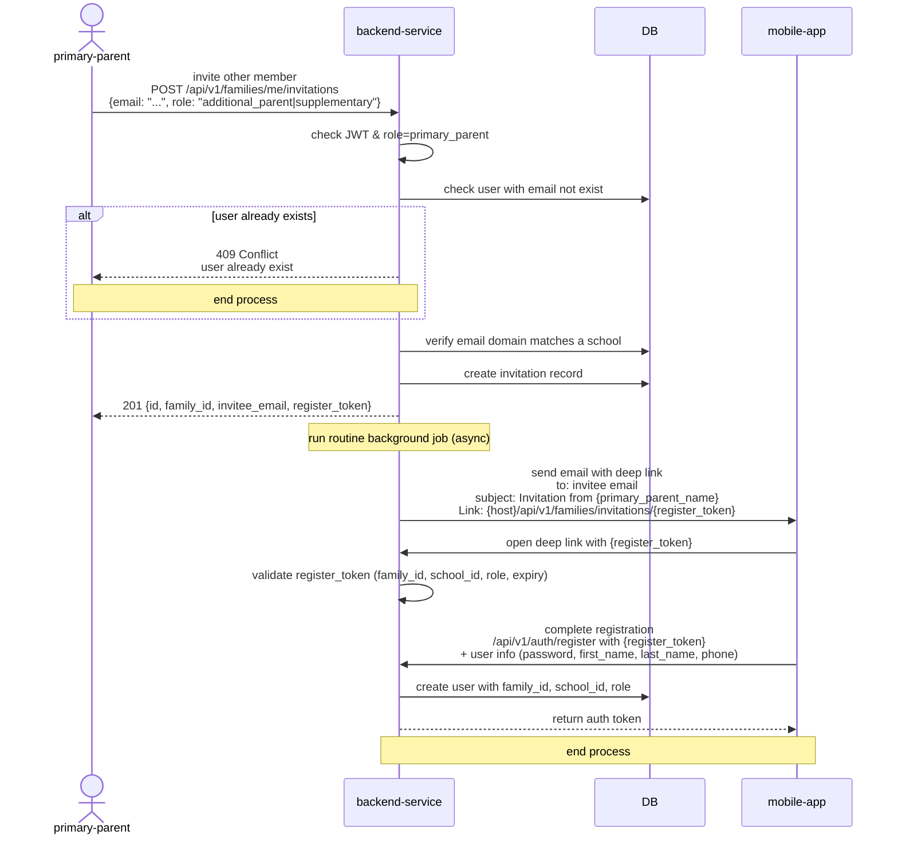

## Sequence diagram

```mermaid
sequenceDiagram
    actor pp as primary-parent
    participant bs as backend-service
    participant db as DB
    participant m as mobile-app

    pp ->> bs: invite other member<br/>POST /api/v1/families/me/invitations<br/>{email: "...", role: "additional_parent|supplementary"}
    bs ->> bs: check JWT & role=primary_parent
    bs ->> db: check user with email not exist
    alt user already exists
        bs -->> pp: 409 Conflict<br/>user already exist
        note over pp, bs: end process
    end
    bs ->> db: verify email domain matches a school
    bs ->> db: create invitation record
    bs -->> pp: 201 {id, family_id, invitee_email, register_token}
    note over bs: run routine background job (async)
    bs ->> m: send email with deep link<br/>to: invitee email<br/>subject: Invitation from {primary_parent_name}<br/>Link: {host}/api/v1/families/invitations/{register_token}
    m ->> bs: open deep link with {register_token}
    bs ->> bs: validate register_token (family_id, school_id, role, expiry)
    m ->> bs: complete registration<br/>/api/v1/auth/register with {register_token}<br/>+ user info (password, first_name, last_name, phone)
    bs ->> db: create user with family_id, school_id, role
    bs -->> m: return auth token
    note over bs, m: end process
```
