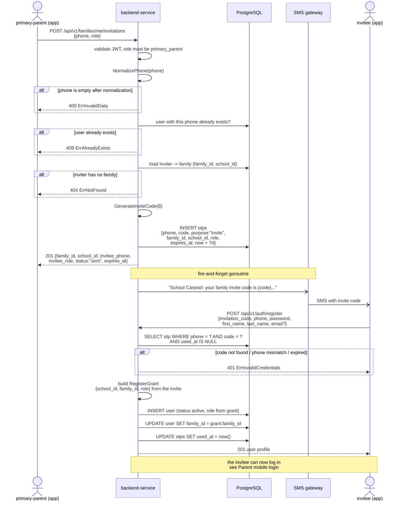

# Add family members

## Overview

A **primary parent** invites another adult into their family — either an
`additional_parent` or a `supplementary` member (driver, grandparent, …).

The invitation is identified by the invitee's **phone number**. The backend
generates a short **invite code**, stores it as an OTP record with
`purpose = "invite"`, and delivers it by **SMS**. The invitee then registers
through the normal `/api/v1/auth/register` endpoint using that code together
with the phone number it was sent to.

> Inviting a **student** works differently — the student is matched against the
> school's records by school email and the account is created immediately.
> See [Invite student](/invite-student).

| | |
| --- | --- |
| Endpoint | `POST /api/v1/families/me/invitations` |
| Allowed role | `primary_parent` only |
| Request body | `{ "phone": "0812345678", "role": "additional_parent" }` — or `"role": "supplementary"` |
| Delivery channel | SMS to `phone` |
| Invite code TTL | **7 days** |

## Sequence diagram

## Invite code

| Property | Value |
| --- | --- |
| Length | 8 characters |
| Charset | `ABCDEFGHJKLMNPQRSTUVWXYZ23456789` — `I`, `O`, `0`, `1` are excluded to avoid misreads |
| Storage | `otps` table, `purpose = "invite"`, indexed on `(phone, code)` |
| Carries | `family_id`, `school_id`, `role` — the invitee never sends these |
| TTL | 7 days (`expires_at`) |
| Single use | consumed by setting `used_at` on successful registration |

**The code alone is not a lookup key.** Lookup is always `phone + code`, so a
code only unlocks the invitation of the exact phone number it was sent to.
Client input is normalized before lookup:

- `NormalizePhone` — strips spaces, `-`, `(`, `)`, leading `+`/`0066`, and
  converts a `66…` (11 digit) number to the local `0…` form.
- `NormalizeInviteCode` — trims, uppercases, and strips spaces and dashes, so
  `k7rm-px24` and `K7RMPX24` are the same code.

## Registration request

`register_token` and `invitation_code` are mutually exclusive — exactly one must
be present.

| Field | Required | Notes |
| --- | --- | --- |
| `invitation_code` | required unless `register_token` is given | the 8-character code from SMS |
| `phone` | **required for this flow** | must be the number the code was sent to |
| `password` | ✅ | |
| `first_name` / `last_name` | ✅ | |
| `email` | optional | at least one of `phone` / `email` must be present overall |
| `register_token` | must be omitted here | used by the primary parent onboarding flow instead |

## Error cases

| Situation | Result |
| --- | --- |
| Caller is not `primary_parent` | `401 Unauthorized` (role validator) |
| `phone` empty after normalization | `400 ErrInvalidData` |
| A user already registered with that phone | `409 ErrAlreadyExists` |
| Inviter has no family | `404 ErrNotFound` |
| Code unknown, already used, or sent to a different phone | `401 ErrInvalidCredentials` |
| Code past `expires_at` | `401 ErrInvalidCredentials` |
| Invite record missing `family_id` / `school_id` / `role` | `401 ErrInvalidCredentials` |

> SMS delivery runs in a background goroutine. A `201` means the invitation was
> stored, not that the SMS was already delivered.
