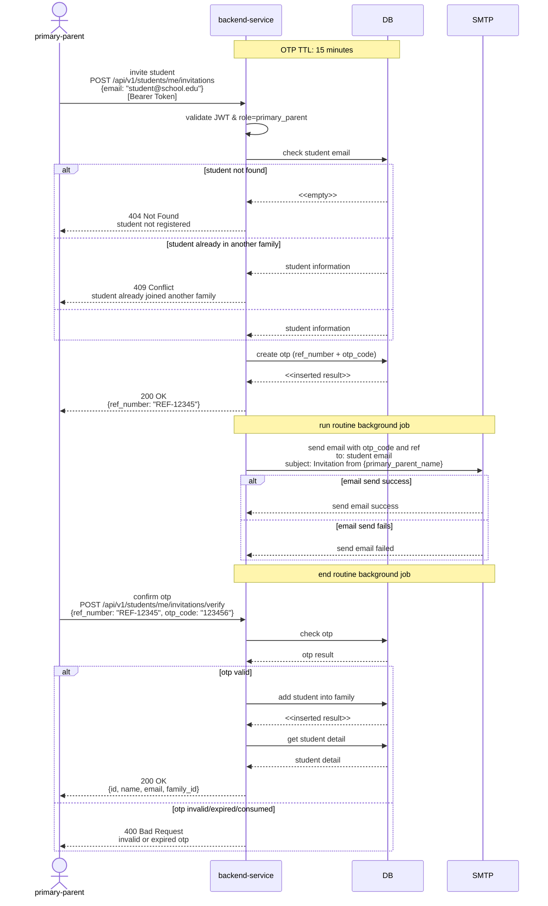

## Sequence diagram

```mermaid
sequenceDiagram
    actor pp as primary-parent
    participant bs as backend-service
    participant db as DB
    participant smtp as SMTP

    note over bs, db: OTP TTL: 15 minutes

    pp ->> bs: invite student<br/>POST /api/v1/students/me/invitations<br/>{email: "student@school.edu"}<br/>[Bearer Token]
    bs ->> bs: validate JWT & role=primary_parent
    bs ->> db: check student email
    alt student not found
        db -->> bs: <<empty>>
        bs -->> pp: 404 Not Found<br/>student not registered
    else student already in another family
        db -->> bs: student information
        bs -->> pp: 409 Conflict<br/>student already joined another family
    else
        db -->> bs: student information
    end
    bs ->> db: create otp (ref_number + otp_code)
    db -->> bs: <<inserted result>>
    bs -->> pp: 200 OK<br/>{ref_number: "REF-12345"}

    note over bs, smtp: run routine background job
    bs ->> smtp: send email with otp_code and ref<br/>to: student email<br/>subject: Invitation from {primary_parent_name}
    alt email send success
        smtp -->> bs: send email success
    else email send fails
        smtp -->> bs: send email failed
    end
    note over bs, smtp: end routine background job

    pp ->> bs: confirm otp<br/>POST /api/v1/students/me/invitations/verify<br/>{ref_number: "REF-12345", otp_code: "123456"}
    bs ->> db: check otp
    db -->> bs: otp result
    alt otp valid
        bs ->> db: add student into family
        db -->> bs: <<inserted result>>
        bs ->> db: get student detail
        db -->> bs: student detail
        bs -->> pp: 200 OK<br/>{id, name, email, family_id}
    else otp invalid/expired/consumed
        bs -->> pp: 400 Bad Request<br/>invalid or expired otp
    end
```
