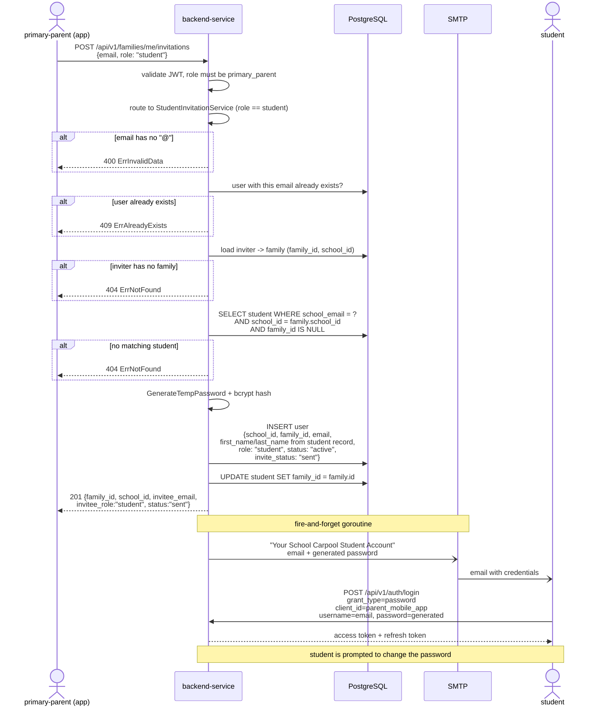

# Invite student

## Overview

A **primary parent** attaches a student to their family by inviting the
student's **school email address**.

Unlike the adult invitation flow, there is **no invite code and no registration
step**. The backend matches the email against the school's own student records,
creates the student's user account immediately with a generated temporary
password, links the student record to the family, and emails the credentials to
the school address.

| | |
| --- | --- |
| Endpoint | `POST /api/v1/families/me/invitations` |
| Allowed role | `primary_parent` only |
| Request body | `{ "email": "student@school.ac.th", "role": "student" }` |
| Delivery channel | Email to the school address |
| Result | Account created straight away, `status = active` |

> **This flow is for *additional* children only.** The student whose school
> email was used to onboard the primary parent is attached to the family and
> given an account automatically during registration — see
> [Primary parent registration](/primary-parent-registration). Inviting that
> same student again fails with `409 ErrAlreadyExists`.

> For `additional_parent` and `supplementary` invitations, the same endpoint
> takes a `phone` and sends an invite code by SMS instead — see
> [Add family members](/add-family-members).

## Sequence diagram

## Matching rules

The student must already exist in the school's records. All three conditions
must hold, otherwise the invite is rejected with `404 ErrNotFound`:

| Condition | Reason |
| --- | --- |
| `student.school_email` matches the invited email | identity comes from the school record, not from user input |
| `student.school_id` equals the inviter's family `school_id` | a parent can only pull students from their own school |
| `student.family_id` is empty | the student is not already attached to another family |

The created user takes `first_name` and `last_name` from the **student record**,
not from anything the parent typed.

## Request fields

`RequestInviteFamilyMember` is shared across all invite roles, and validation is
conditional on `role`:

| Field | Rule |
| --- | --- |
| `role` | required, one of `additional_parent`, `supplementary`, `student` |
| `email` | required when `role = "student"`, ignored otherwise |
| `phone` | required when `role != "student"`, ignored otherwise |

## Error cases

| Situation | Result |
| --- | --- |
| Caller is not `primary_parent` | `401 Unauthorized` (role validator) |
| `email` missing or has no `@` | `400 ErrInvalidData` |
| A user already registered with that email | `409 ErrAlreadyExists` |
| Inviter has no family | `404 ErrNotFound` |
| No unattached student with that email in the school | `404 ErrNotFound` |

> Email delivery runs in a background goroutine. A `201` means the account was
> created and the student record linked, not that the email was already
> delivered. The generated password is never returned in the API response — it
> exists only in the email.
