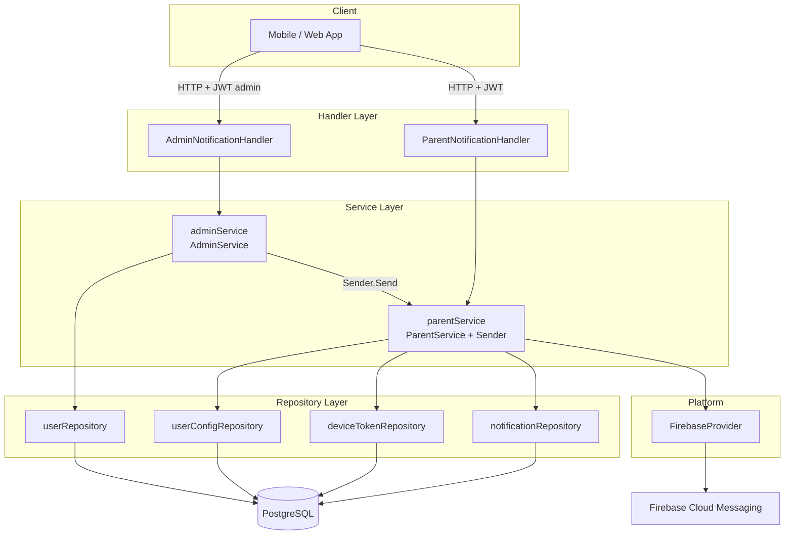
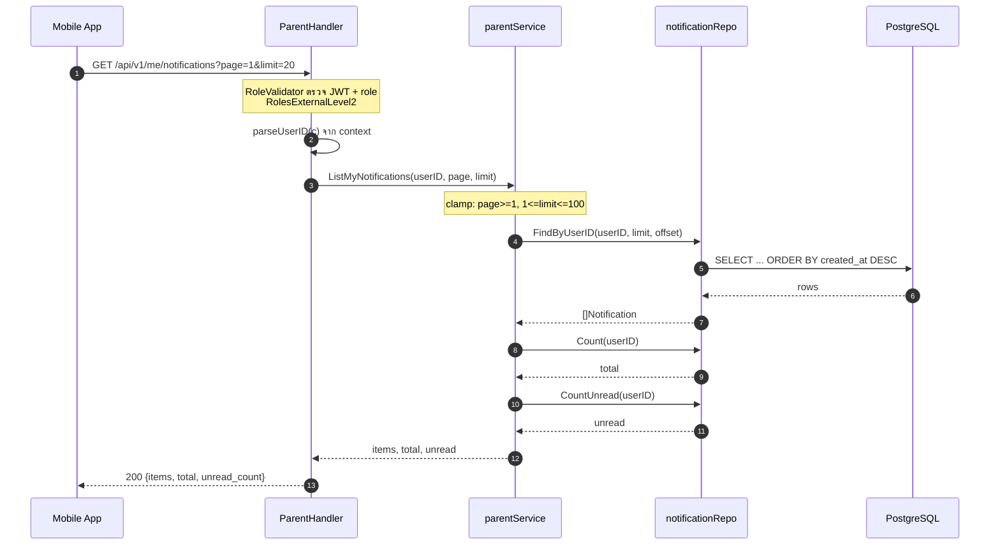
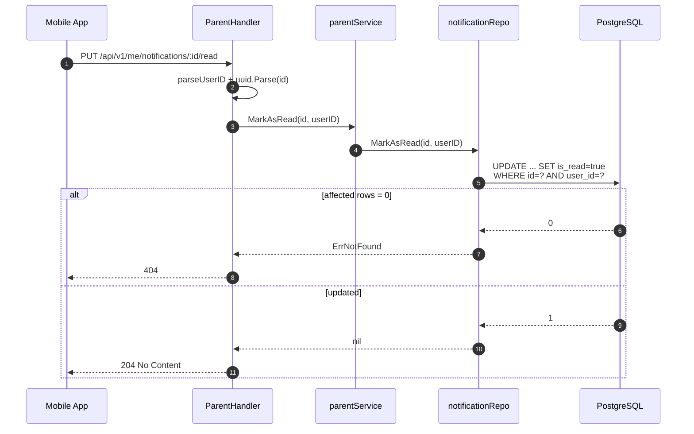
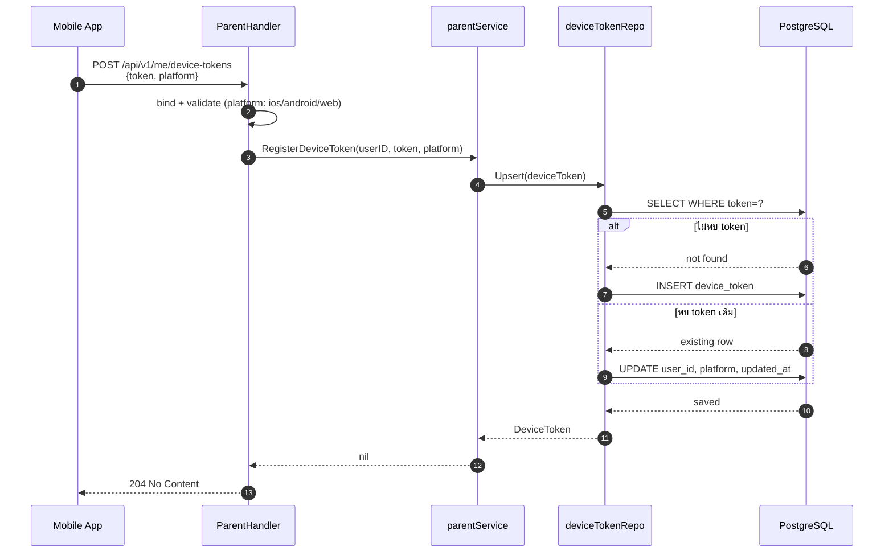
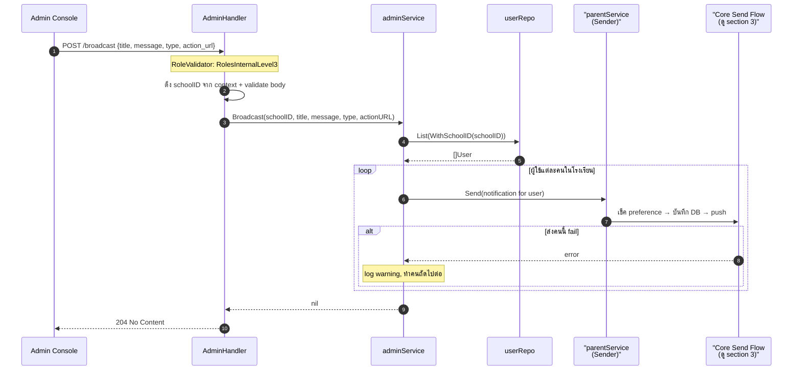
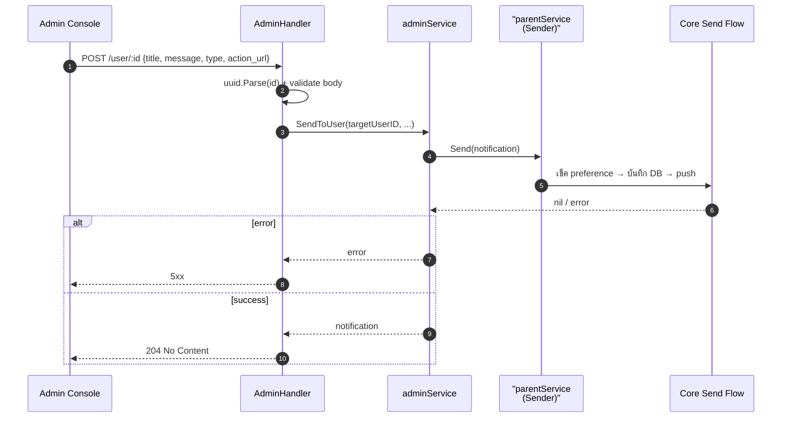
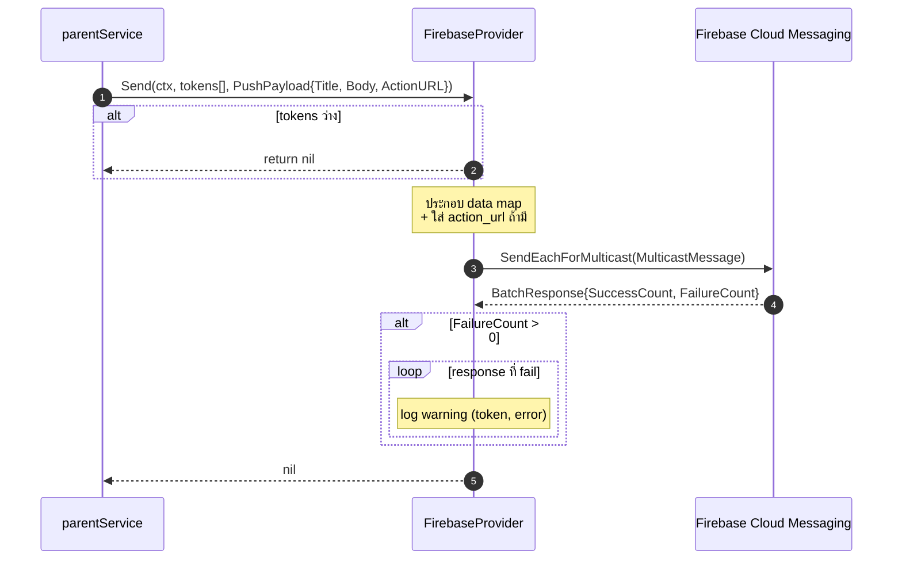
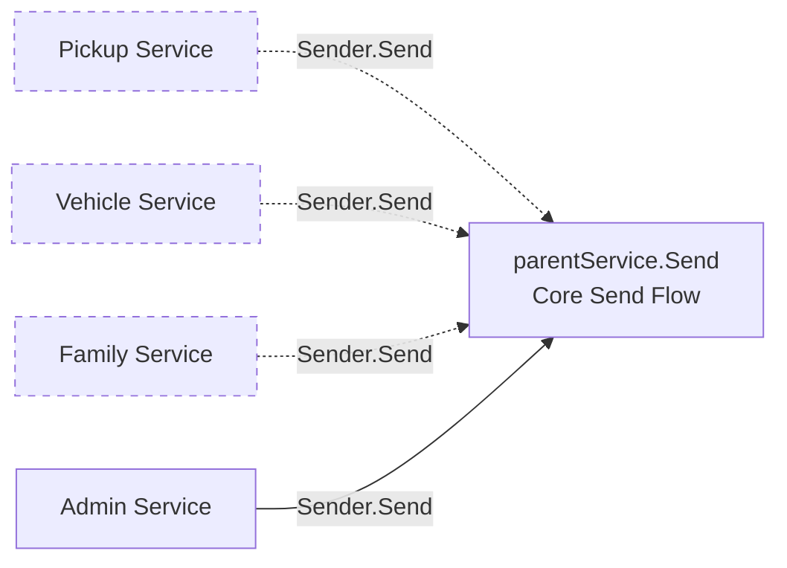

# Notification Flow — เอกสารอธิบายระบบแจ้งเตือน (Pending)

เอกสารนี้อธิบายการทำงานของ **Notification Module** ของ backend-service ตั้งแต่
การรับ request, การบันทึกลงฐานข้อมูล, ไปจนถึงการส่ง push notification ผ่าน Firebase Cloud Messaging (FCM)

---

## 1. ภาพรวมสถาปัตยกรรม (Architecture Overview)

ระบบแจ้งเตือนออกแบบตามแนวทาง **Ports & Adapters (Hexagonal)** โดยแยกส่วนชัดเจน:

| Layer                  | File                                                                                                                                                        | Description                                                     |
| ---------------------- | ----------------------------------------------------------------------------------------------------------------------------------------------------------- | --------------------------------------------------------------- |
| **Handler**            | [handler_parent.go](internal/modules/notification/handler_parent.go), [handler_admin.go](internal/modules/notification/handler_admin.go)                    | รับ HTTP request (Fiber), ตรวจ JWT/role, validate input         |
| **Service**            | [service_parent.go](internal/modules/notification/service_parent.go), [service_admin.go](internal/modules/notification/service_admin.go)                    | logic หลัก: บันทึก, อ่าน, mark-read, broadcast, เช็ค preference |
| **Repository**         | [repository.go](internal/modules/notification/repository.go)                                                                                                | เข้าถึง DB ผ่าน Ent (notifications, device_tokens)              |
| **Push Provider**      | [firebase.go](internal/platform/pushnotification/firebase.go)                                                                                               | ส่ง push จริงผ่าน FCM                                           |
| **Ports (interfaces)** | [services/notification](internal/ports/services/notification/service.go), [platform/pushnotification](internal/ports/platform/pushnotification/provider.go) | สัญญา (contract) ที่ decouple แต่ละ layer                       |

จุดสำคัญของการออกแบบ:

- **`parentService` ตัวเดียว** ถูก provide เป็นทั้ง `ParentService` (สำหรับ user) และ `Sender`
  (สำหรับ module อื่น เช่น pickup, family) ผ่าน `fx.Annotate` — ดู [module.go](internal/modules/notification/module.go#L13-L19)
- **`adminService`** ไม่ส่ง push เอง แต่เรียกผ่าน `Sender.Send()` เพื่อ reuse logic เดียวกัน
- **Push provider เป็น interface** — ในอนาคตเพิ่ม Web Push ได้โดยไม่ต้องแก้ service layer



---

## 2. โมเดลข้อมูล (Domain Models)

### Notification — [notification.go](internal/shared/domain/notification.go)

| Field       | Type           | คำอธิบาย                          |
| ----------- | -------------- | --------------------------------- |
| `ID`        | UUID           | รหัสแจ้งเตือน                     |
| `UserID`    | UUID           | เจ้าของแจ้งเตือน                  |
| `Type`      | string         | ประเภท (ดูด้านล่าง)               |
| `Title`     | string         | หัวข้อ                            |
| `Message`   | string         | เนื้อหา                           |
| `IsRead`    | bool           | อ่านแล้วหรือยัง (default `false`) |
| `ActionURL` | \*string       | ลิงก์ deep-link (nullable)        |
| `Data`      | map[string]any | metadata เพิ่มเติม (future-proof) |
| `CreatedAt` | time.Time      | เวลาสร้าง                         |

**ประเภทแจ้งเตือน (Notification Types):**

```go
NotificationTypePickupUpdate   = "pickup_update"   // อัปเดตสถานะการรับ-ส่ง
NotificationTypeCarpoolRequest = "carpool_request" // คำขอ carpool
NotificationTypeFamilyActivity = "family_activity" // กิจกรรมในครอบครัว
NotificationTypeSystemUpdate   = "system_update"   // ประกาศจากระบบ
```

ประเภทเหล่านี้ใช้จับคู่กับ **notification preference** ของผู้ใช้ (จาก `user_config`)
เพื่อตัดสินว่าจะส่งหรือไม่

### DeviceToken — [device_token.go](internal/shared/domain/device_token.go)

เก็บ FCM token ของแต่ละอุปกรณ์ มี platform เป็น `ios` / `android` / `web`
`token` เป็น unique — การลงทะเบียนซ้ำจะเป็นการ **upsert** (อัปเดตเจ้าของ + platform)

---

## 3. Flow ที่ 1 — การส่งแจ้งเตือน (Core Send Flow)

นี่คือหัวใจของระบบ อยู่ในเมธอด `parentService.Send()`
([service_parent.go:98](internal/modules/notification/service_parent.go#L98))
ทุกการส่งแจ้งเตือน (ไม่ว่าจาก admin หรือ module อื่น) จะวิ่งผ่าน flow นี้

**ลำดับขั้น:**

1. **เช็ค preference** — เรียก `isNotificationAllowed()` อ่าน config ของผู้ใช้ ถ้าผู้ใช้ปิดแจ้งเตือนประเภทนั้น → จบเลย (return `nil` แบบเงียบ ๆ ไม่ error)
2. **บันทึกลง DB** — `notifRepo.Create()` เพื่อให้ผู้ใช้เห็น history ในแอปได้
3. **ดึง device tokens** — `deviceTokenRepo.FindByUserID()` ถ้าดึงไม่ได้ → log warning แต่ **ไม่ fail** (record ใน DB ถือว่าสำเร็จแล้ว)
4. **ถ้าไม่มี token** → จบ (เช่น ผู้ใช้ยังไม่เคย login บนมือถือ)
5. **ส่ง push** — `pushProvider.Send()` ถ้า FCM ล้มเหลว → log warning แต่ **ไม่ fail**

> หลักการสำคัญ: **การบันทึก DB คือ source of truth** ส่วน push เป็น best-effort
> ถ้า push ล้มเหลว ผู้ใช้ยังเห็นแจ้งเตือนในแอปได้อยู่

```mermaid
sequenceDiagram
    autonumber
    participant Caller as "Caller<br/>(admin / pickup / family)"
    participant PS as "parentService.Send()"
    participant UC as userConfigRepo
    participant NR as notificationRepo
    participant DR as deviceTokenRepo
    participant FCM as FirebaseProvider
    participant G as "Firebase (FCM)"

    Caller->>PS: Send(ctx, notification)

    PS->>UC: GetByUserID(userID)
    UC-->>PS: user config (preferences)
    Note over PS: isNotificationAllowed()<br/>เช็คตาม Type
    alt ผู้ใช้ปิดแจ้งเตือนประเภทนี้
        PS-->>Caller: return nil (ไม่ทำอะไรต่อ)
    end

    PS->>NR: Create(notification)
    NR-->>PS: saved notification (IsRead=false)

    PS->>DR: FindByUserID(userID)
    alt ดึง token ไม่ได้
        DR-->>PS: error
        Note over PS: log warning, return nil<br/>(DB record สำเร็จแล้ว)
    end
    DR-->>PS: []DeviceToken

    alt ไม่มี device token
        Note over PS: return nil
    end

    PS->>FCM: Send(tokens, PushPayload)
    FCM->>G: SendEachForMulticast(message)
    G-->>FCM: BatchResponse
    alt มี token ส่งไม่สำเร็จบางตัว
        Note over FCM: log warning ราย token<br/>ไม่ fail ทั้ง batch
    end
    FCM-->>PS: nil / error
    alt push error
        Note over PS: log warning เท่านั้น
    end
    PS-->>Caller: return nil
```



---

## 4. Flow ที่ 2 — ผู้ปกครองดู/จัดการแจ้งเตือน (Parent Flows)

Route ทั้งหมดอยู่ภายใต้ `/api/v1/me/...` ป้องกันด้วย
`NewRoleValidator(jwtValidator, RolesExternalLevel2)` — ดู [handler_parent.go:30-41](internal/modules/notification/handler_parent.go#L30-L41)

| Method | Path                                    | Handler                 | คำอธิบาย                                   |
| ------ | --------------------------------------- | ----------------------- | ------------------------------------------ |
| GET    | `/api/v1/me/notifications`              | `ListNotifications`     | list แบบ pagination + total + unread count |
| GET    | `/api/v1/me/notifications/unread-count` | `UnreadCount`           | จำนวนที่ยังไม่อ่าน                         |
| PUT    | `/api/v1/me/notifications/read-all`     | `MarkAllAsRead`         | อ่านทั้งหมด                                |
| PUT    | `/api/v1/me/notifications/:id/read`     | `MarkAsRead`            | อ่านรายการเดียว                            |
| DELETE | `/api/v1/me/notifications/:id`          | `DeleteNotification`    | ลบ (hard delete)                           |
| POST   | `/api/v1/me/device-tokens`              | `RegisterDeviceToken`   | ลงทะเบียน FCM token                        |
| DELETE | `/api/v1/me/device-tokens`              | `UnregisterDeviceToken` | ลบ token (เช่นตอน logout)                  |

> หมายเหตุเรื่อง route order: `read-all` ถูกประกาศ**ก่อน** `:id/read`
> เพื่อไม่ให้ Fiber จับ `read-all` เป็นค่า `:id`

### 4.1 List notifications



### 4.2 Mark as read / Mark all / Delete

ทั้งสาม operation มี pattern เดียวกัน: query แบบมี `WHERE id=? AND user_id=?`
เพื่อกัน user ไปแก้แจ้งเตือนของคนอื่น ถ้าไม่เจอ row จะคืน `domain.ErrNotFound` (404)



### 4.3 ลงทะเบียน Device Token (Upsert)

`RegisterDeviceToken` ใช้ logic **upsert** — ถ้า token มีอยู่แล้วจะอัปเดตเจ้าของ + platform
มีประโยชน์เมื่อผู้ใช้คนใหม่ login บนเครื่องเดิม (token ย้ายเจ้าของ)



---

## 5. Flow ที่ 3 — Admin ส่งแจ้งเตือน (Admin Flows)

Route อยู่ภายใต้ `/api/v1/admin/notifications/...` ป้องกันด้วย
`RolesInternalLevel3` — ดู [handler_admin.go:29-33](internal/modules/notification/handler_admin.go#L29-L33)

| Method | Path                                    | คำอธิบาย                   |
| ------ | --------------------------------------- | -------------------------- |
| POST   | `/api/v1/admin/notifications/broadcast` | ส่งหาผู้ใช้ทุกคนในโรงเรียน |
| POST   | `/api/v1/admin/notifications/user/:id`  | ส่งหาผู้ใช้คนเดียว         |

จุดสำคัญ: `adminService` **ไม่ส่ง push เอง** แต่เรียก `Sender.Send()` (ซึ่งคือ `parentService`)
ทำให้ทุกแจ้งเตือนผ่าน flow เดียวกัน (เช็ค preference + บันทึก DB + push)

### 5.1 Broadcast — ส่งทั้งโรงเรียน

`schoolID` ดึงจาก JWT context (`ContextKeySchoolID`) ไม่ได้รับจาก body
จากนั้น fan-out ส่งทีละคน หากคนใดล้มเหลว → log warning แต่ทำคนอื่นต่อ



### 5.2 Send to User — ส่งคนเดียว



---

## 6. การส่ง Push ผ่าน Firebase (FCM Detail)

`FirebaseProvider` ([firebase.go](internal/platform/pushnotification/firebase.go))
ใช้ Firebase Admin SDK (`firebase.google.com/go/v4/messaging`)

- **Init**: อ่าน credentials จากไฟล์ใน `Config.Firebase.CredentialsFile` + `ProjectID`
- **Send**: ใช้ `SendEachForMulticast` ส่งหลาย token ในครั้งเดียว
- **ActionURL**: ถูกแนบเข้าไปใน field `data["action_url"]` ของ message
- **Error handling**: ถ้าบาง token ส่งไม่ผ่าน (เช่น token หมดอายุ) → log warning ราย token
  โดย**ไม่ทำให้ทั้ง batch fail**



> **Web Push (ยังไม่ทำ):** ออกแบบไว้ให้เพิ่ม `WebPushProvider` ที่ implement
> interface `Provider` เดียวกันได้ในอนาคต โดยไม่ต้องแก้ service layer — แค่สลับ provider ใน `app.go`

---

## 7. การ Wiring ด้วย Uber Fx

ดู [module.go](internal/modules/notification/module.go)

```go
var Module = fx.Module("notification",
    fx.Provide(NewNotificationRepository),
    fx.Provide(NewDeviceTokenRepository),
    // provide *parentService เป็นทั้ง ParentService และ Sender (instance เดียว)
    fx.Provide(
        fx.Annotate(
            NewParentServiceImpl,
            fx.As(new(notifService.ParentService)),
            fx.As(new(notifService.Sender)),
        ),
    ),
    fx.Provide(NewAdminService),
    fx.Provide(NewParentNotificationHandler),
    fx.Provide(NewAdminNotificationHandler),
    fx.Invoke(func(app *fiber.App, ph *ParentNotificationHandler, ah *AdminNotificationHandler) {
        ph.RegisterRoutes(app)
        ah.RegisterRoutes(app)
    }),
)
```

`FirebaseProvider` ถูก provide แยกในระดับ platform/base module และ inject เข้า `parentService`

---

## 8. การเชื่อมกับ Module อื่น (Integration Points)

`Sender` interface ([service.go:26-28](internal/ports/services/notification/service.go#L26-L28))
ออกแบบให้ module อื่น inject ไปใช้ส่งแจ้งเตือนได้ โดยไม่ต้องพึ่ง notification service ทั้งก้อน
และไม่เกิด circular dependency (เพราะเป็นแค่ interface)

แผนการเชื่อมต่อ (ดู Phase 8 ของ implementation plan):

- **Pickup service** — ส่งเมื่อสถานะการรับ-ส่งเปลี่ยน (`pickup_update`)
- **Vehicle service** — ส่งเมื่ออนุมัติ/ปฏิเสธรถ
- **Family service** — ส่งเมื่อมีการ ban

> สถานะปัจจุบัน: ยังไม่มี module อื่น import `Sender` (ตรวจแล้วไม่พบ consumer นอก notification module)
> — ส่วนนี้เป็น integration ที่รอทำต่อ



(เส้นประ = ยังไม่ได้ implement)

---

## 9. สรุปหลักการออกแบบ (Design Principles)

1. **DB เป็น source of truth** — บันทึกก่อนเสมอ, push เป็น best-effort
2. **Push ล้มเหลวไม่ทำให้ request fail** — ใช้ log warning แทน error
3. **เคารพ preference ผู้ใช้** — เช็ค `user_config` ก่อนส่งทุกครั้ง
4. **Single send flow** — ทั้ง admin และ module อื่นเรียกผ่าน `Sender.Send()` ตัวเดียวกัน
5. **Provider เป็น interface** — เปลี่ยน/เพิ่มช่องทาง push ได้โดยไม่กระทบ business logic
6. **Ownership check ทุก mutation** — query มี `user_id` กำกับเสมอ กัน cross-user access
