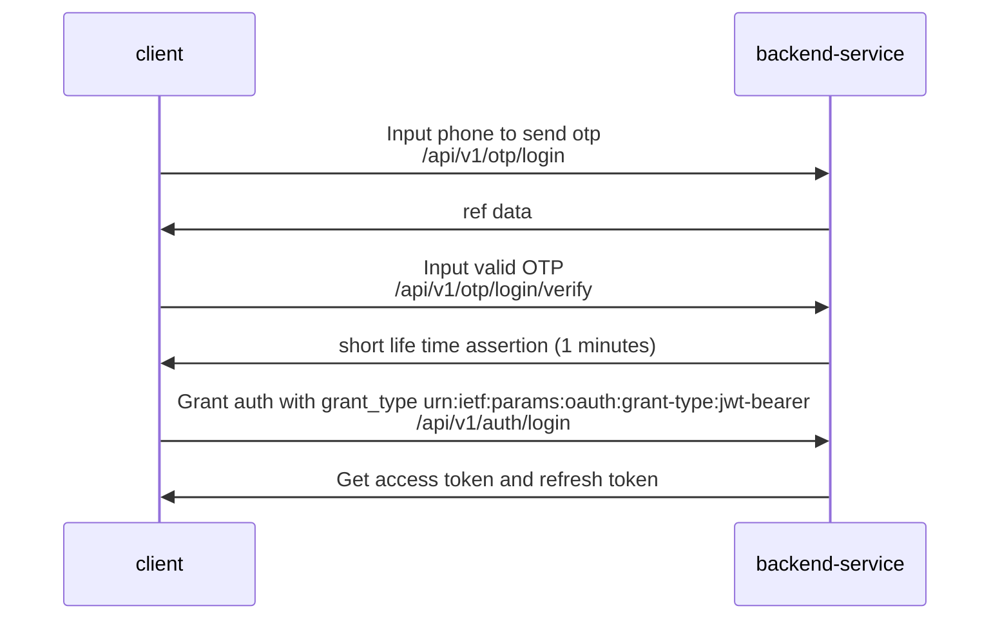

# Parent mobile login

## Sequence diagram

```mermaid
sequenceDiagram
    participant c as client
    participant bs as backend-service

    c ->> bs: Input phone to send otp<br/>/api/v1/otp/login
    bs ->> c: ref data
    c ->> bs: Input valid OTP<br/>/api/v1/otp/login/verify
    bs ->> c: short life time assertion (1 minutes)
    c ->> bs: Grant auth with grant_type urn:ietf:params:oauth:grant-type:jwt-bearer<br/>/api/v1/auth/login
    bs ->> c: Get access token and refresh token
```
