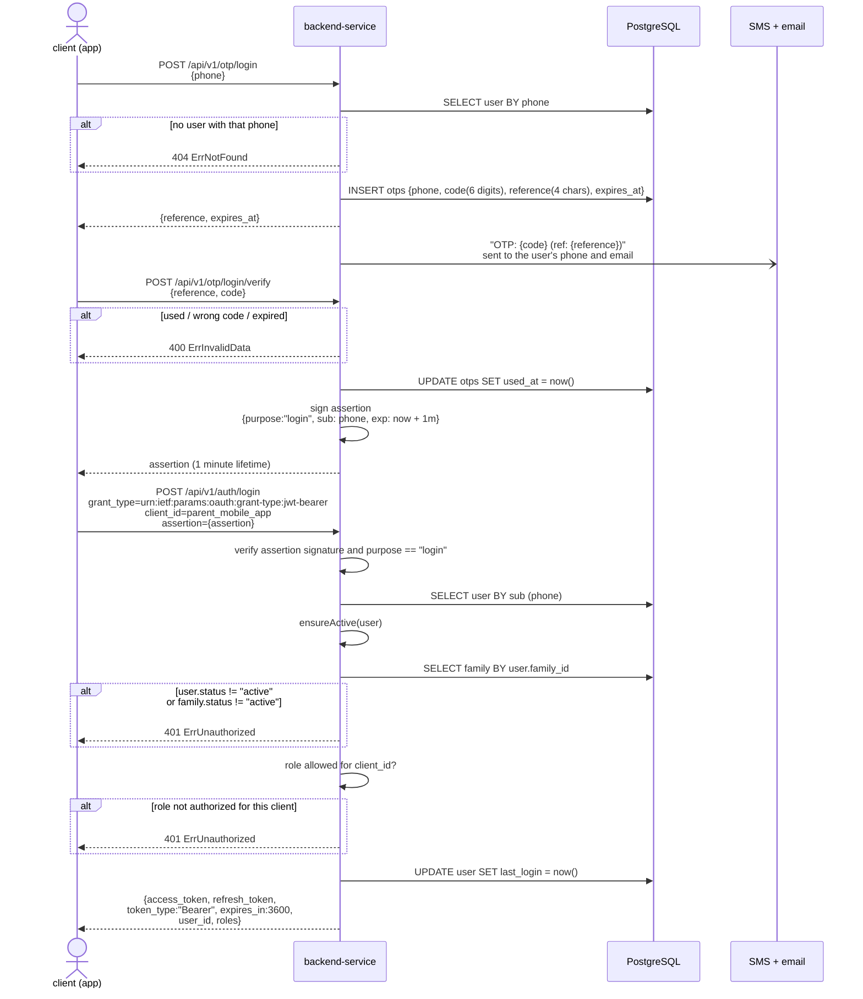
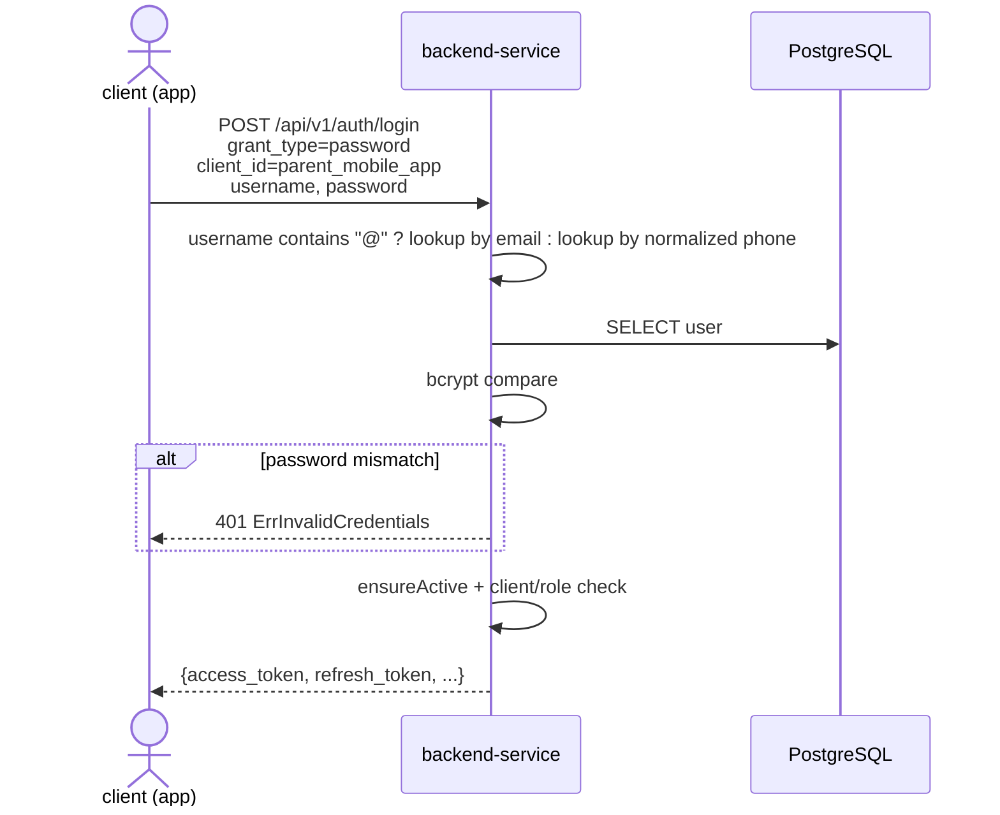

# Parent mobile login

## Overview

`POST /api/v1/auth/login` is a single endpoint with three grant types. Every
grant resolves a user, then passes through the **same** issuing path:

1. `ensureActive` — the user **and** their family must be `active`
2. `client_id` ↔ role authorization — the resolved role must be allowed for the
   calling client
3. update `last_login`, then sign the access and refresh tokens

| Grant type | Used for | Required fields |
| --- | --- | --- |
| `urn:ietf:params:oauth:grant-type:jwt-bearer` | OTP login (phone) | `assertion` |
| `password` | email/phone + password login (e.g. an invited student) | `username`, `password` |
| `refresh_token` | silent renewal | `refresh_token` |

`client_id` is required for all three. The parent mobile app sends
`client_id = parent_mobile_app`, which authorizes the roles
`primary_parent`, `additional_parent`, `supplementary`, and `student`.

## Sequence diagram — OTP login (jwt-bearer)

## Sequence diagram — password grant

Used by accounts that were given a password directly — most notably a student
invited by their parent, who receives a generated password by email (see
[Invite student](/invite-student)).

`refresh_token` grant works the same way, resolving the user from the `sub`
claim of the refresh token before running the identical checks.

## Activation gate (`ensureActive`)

Every grant runs this before a token is issued:

| Check | Failure |
| --- | --- |
| `user.status == "active"` | `401 ErrUnauthorized` |
| `user.family_id` is null | ✅ allowed — the gate stops here (staff/admin have no family) |
| family loaded and `family.status == "active"` | `401 ErrUnauthorized` |

A user in `pending` status, or one whose family has been suspended, cannot log
in with **any** grant type.

## Client ↔ role authorization

| `client_id` | Authorized roles |
| --- | --- |
| `parent_mobile_app` | `primary_parent`, `additional_parent`, `supplementary`, `student` |
| `admin_crm` | `admin` |
| `stuff_crm` | `staff` |
| `business_crm` | `owner` |
| `dashboard_crm` | `screen_display` |

An unknown `client_id`, or a role not in that client's list, fails with
`401 ErrUnauthorized` — even when the password or assertion was correct.

## Token response

| Field | Value |
| --- | --- |
| `access_token` | HS256 JWT, **1 hour** |
| `refresh_token` | HS256 JWT, **7 days** |
| `token_type` | `Bearer` |
| `expires_in` | `3600` |
| `user_id` | resolved user ID |
| `roles` | single-element array with the user's role |

Access token claims: `sub`, `user_id`, `aud`/`client_id`, `roles`, `exp`, `iat`,
plus `school_id` (omitted for `owner`) and `family_id` (omitted when the user has
no family).
