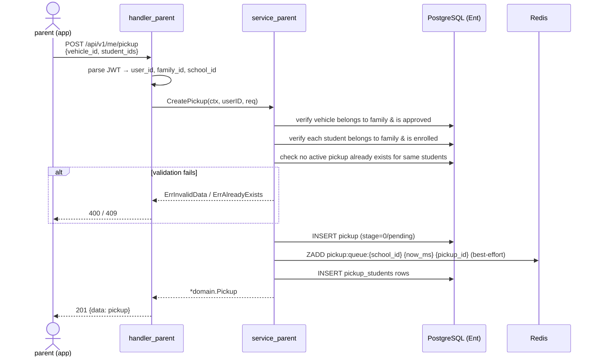
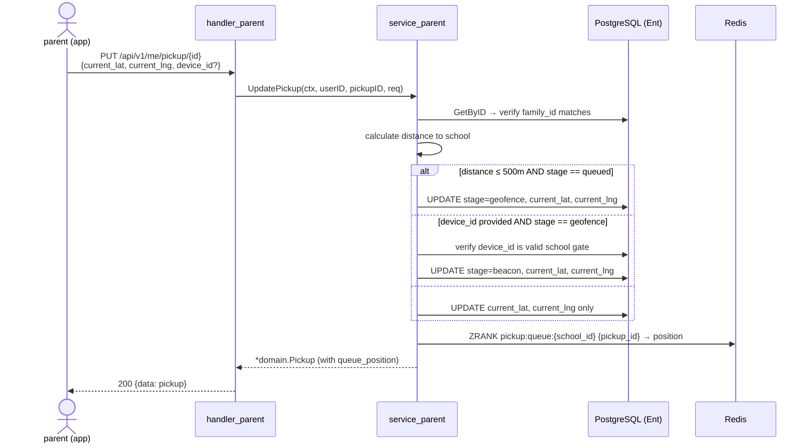
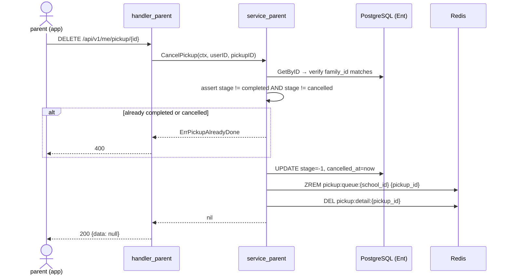
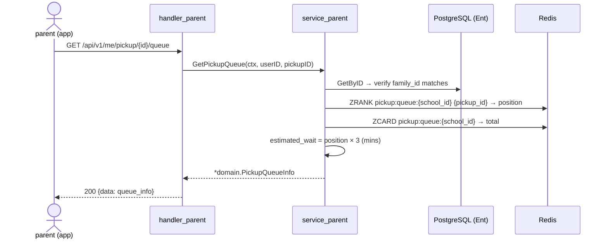

# Pickup Student

## Overview

A **Pickup** represents a parent's intent to pick up one or more of their children from school. Parents initiate a pickup session, which is placed into a school-managed queue. The pickup progresses through lifecycle stages from `pending` → `queued` → `geofence` → `beacon` → `completed` (or `cancelled`). Redis manages the real-time queue; PostgreSQL (via Ent ORM) is the source of truth for persistence.

## Functional Requirements

- `primary_parent` and `additional_parent` can **create** and **cancel** a pickup
- `primary_parent`, `additional_parent`, and `supplementary` (same family) can **read** and **update** a pickup
- Same-family members can view the list, detail, and queue position of any pickup
- On creation, the parent selects one or more enrolled children and an approved vehicle
- On update, the parent sends GPS position; backend calculates stage and optionally associates a device ID
- A pickup is **soft-deleted** (cancelled); never hard-deleted

## Non-Functional Requirements

- Queue ordering managed in **Redis** (Sorted Set, score = epoch timestamp of creation)
- Pickup records persisted in **PostgreSQL** via Ent ORM
- Queue operations must be atomic (Redis transactions / Lua scripts where needed)
- Queue key per school: `pickup:queue:{school_id}`
- Queue display info cached in Redis Hash: `pickup:detail:{pickup_id}` (TTL 6 hours)
- Position lookup: O(log N) via `ZRANK` on the sorted set

## Access Control

| Role | Create | Read | Update | Cancel |
| ---- | :----: | :--: | :----: | :----: |
| `primary_parent` | ✅ | ✅ | ✅ | ✅ |
| `additional_parent` | ✅ | ✅ | ✅ | ✅ |
| `supplementary` | ❌ | ✅ | ✅ | ❌ |

> JWT claims required in context: `user_id`, `family_id`, `school_id`

## Pickup Lifecycle (Stages)

```
pending(0) → queued(1) → geofence(2) → beacon(3) → completed(4)
                      ↘           ↘          ↘
                                    cancelled(-1)
```

| Stage | Value | Trigger | Description |
| ----- | ----- | ------- | ----------- |
| `pending` | 0 | Pickup created by parent | Created; parent has not approached school yet |
| `queued` | 1 | GPS within **5 km** of school | Entered school queue (ZADD to Redis sorted set) |
| `geofence` | 2 | GPS within **500 m** of school | Parent is very close; school display and staff are alerted |
| `beacon` | 3 | `device_id` received matching a registered gate unit | Parent physically at the gate; student is being released |
| `completed` | 4 | Explicit completion call / school-side confirmation | Student successfully handed over |
| `cancelled` | -1 | Parent cancels; stage must not be `completed` | Soft-deleted; removed from Redis queue |

> **Geofence radius:** hardcoded at `500 m`. Future: configurable per school via admin platform (`school_settings.geofence_radius_m`).

## Sequence Diagrams

### Create Pickup



### Update Pickup (with stage transition)



### Cancel Pickup



### Get Queue Position



## Endpoints

Base: `/api/v1/me/pickup`

| Method | Path | Roles | Description |
| ------ | ---- | ----- | ----------- |
| `GET` | `/available-children` | `primary_parent`, `additional_parent` | List enrolled children in family |
| `GET` | `/available-vehicles` | `primary_parent`, `additional_parent` | List approved vehicles in family |
| `GET` | `/` | all access-control roles | List my active pickups |
| `GET` | `/{id}` | all access-control roles (same family) | Get pickup detail |
| `GET` | `/{id}/queue` | all access-control roles (same family) | Get queue position and ETA |
| `POST` | `/` | `primary_parent`, `additional_parent` | Create new pickup |
| `PUT` | `/{id}` | all access-control roles (same family) | Update pickup position / stage |
| `DELETE` | `/{id}` | `primary_parent`, `additional_parent` | Cancel pickup |

## Domain Models

```go
// Pickup — stage values: -1=cancelled 0=pending 1=queued 2=geofence 3=beacon 4=completed
type Pickup struct {
    ID          uuid.UUID  `json:"id"`
    SchoolID    uuid.UUID  `json:"school_id"`
    FamilyID    uuid.UUID  `json:"family_id"`
    CreatedBy   uuid.UUID  `json:"created_by"`
    VehicleID   uuid.UUID  `json:"vehicle_id"`
    Stage       int        `json:"stage"`
    CurrentLat  *float64   `json:"current_lat,omitempty"`
    CurrentLng  *float64   `json:"current_lng,omitempty"`
    Lane        *string    `json:"lane,omitempty"`
    Notes       *string    `json:"notes,omitempty"`
    QueuedAt    *time.Time `json:"queued_at,omitempty"`
    CompletedAt *time.Time `json:"completed_at,omitempty"`
    CancelledAt *time.Time `json:"cancelled_at,omitempty"`
    CreatedAt   time.Time  `json:"created_at"`
    UpdatedAt   time.Time  `json:"updated_at"`

    // Edges — populated on demand
    Vehicle  *Vehicle  `json:"vehicle,omitempty"`
    Students []Student `json:"students,omitempty"`
}

// PickupQueueInfo is returned by GET /{id}/queue
type PickupQueueInfo struct {
    PickupID          uuid.UUID `json:"pickup_id"`
    Position          int64     `json:"position"`
    TotalInQueue      int64     `json:"total_in_queue"`
    EstimatedWaitMins int       `json:"estimated_wait_mins"`
}

// CreatePickupRequest is the validated service input for POST /
type CreatePickupRequest struct {
    VehicleID  uuid.UUID   `json:"vehicle_id"`
    StudentIDs []uuid.UUID `json:"student_ids"`
    Notes      *string     `json:"notes"`
}

// UpdatePickupRequest is the validated service input for PUT /{id}
type UpdatePickupRequest struct {
    CurrentLat *float64 `json:"current_lat"`
    CurrentLng *float64 `json:"current_lng"`
    DeviceID   *int     `json:"device_id"` // optional school gate device
}
```

## Database Schema

### `pickups`

| Column | Type | Constraint | Description |
| ------ | ---- | ---------- | ----------- |
| `id` | `uuid` | PK, default uuid | Pickup ID |
| `school_id` | `uuid` | NOT NULL, index | School this pickup belongs to |
| `family_id` | `uuid` | NOT NULL, index | Family that created this pickup |
| `created_by` | `uuid` | NOT NULL | User ID who initiated the pickup |
| `vehicle_id` | `uuid` | NOT NULL | Vehicle used for this pickup |
| `stage` | `int` | NOT NULL, default 0 | Pickup stage (see lifecycle above) |
| `current_lat` | `float64` | nullable | Parent's last reported latitude |
| `current_lng` | `float64` | nullable | Parent's last reported longitude |
| `lane` | `string` | nullable | Assigned school lane / gate |
| `notes` | `text` | nullable | Optional parent notes |
| `queued_at` | `timestamp` | nullable | When pickup entered the school queue |
| `completed_at` | `timestamp` | nullable | When pickup was marked completed |
| `cancelled_at` | `timestamp` | nullable | When pickup was cancelled (soft delete signal) |
| `created_at` | `timestamp` | NOT NULL, immutable | Record creation time |
| `updated_at` | `timestamp` | NOT NULL | Record last updated time |

**Indexes:** `(school_id)`, `(family_id)`, `(school_id, stage)`

### `pickup_students` (join table)

| Column | Type | Constraint | Description |
| ------ | ---- | ---------- | ----------- |
| `id` | `uuid` | PK | Row ID |
| `pickup_id` | `uuid` | FK → pickups.id | Pickup reference |
| `student_id` | `uuid` | FK → students.id | Student reference |

**Unique constraint:** `(pickup_id, student_id)`

### `devices` (existing — read-only in this feature)

| Column | Type | Description |
| ------ | ---- | ----------- |
| `id` | `int` | Primary key |
| `name` | `string` | Device name (e.g. "Gate A") |
| `type` | `string` | Device type |
| `school_location_id` | `int` | School Location ID |
| `created_at` | `timestamp` | Created time |
| `updated_at` | `timestamp` | Updated time |
| `deleted_at` | `timestamp` | Deleted time (soft delete) |

## Redis Data Structures

### 1. School Queue — `pickup:queue:{school_id}` (Sorted Set)

```
ZADD pickup:queue:{school_id} {unix_epoch_ms} {pickup_id}
ZRANK pickup:queue:{school_id} {pickup_id}    → queue position (0-based)
ZCARD pickup:queue:{school_id}                → total in queue
ZREM  pickup:queue:{school_id} {pickup_id}    → cancel / complete dequeue
```

### 2. Pickup Detail Cache — `pickup:detail:{pickup_id}` (Hash, TTL 6h)

```
HSET pickup:detail:{pickup_id}
     vehicle       "Toyota Camry · ABC-1234"
     students      "Alice, Bob"
     stage         "1"
     queued_at     "1713254400"

EXPIRE pickup:detail:{pickup_id} 21600
```

## Error Codes

| Error | HTTP | Code | Message |
| ----- | ---- | ---- | ------- |
| `ErrActivePickupExists` | 409 | `40903` | student already has an active pickup |
| `ErrVehicleNotApproved` | 400 | `40006` | vehicle is not approved for pickup |
| `ErrPickupAlreadyDone` | 400 | `40007` | pickup is already completed or cancelled |
| `ErrNotFound` | 404 | `40401` | resource not found |
| `ErrUnauthorized` | 401 | `40101` | unauthorized access |

## Port Interfaces

### `ports/repositories/pickup/repository.go`

```go
type Repository interface {
    Create(ctx context.Context, pickup *domain.Pickup) error
    GetByID(ctx context.Context, id string, opts ...QueryOption) (*domain.Pickup, error)
    List(ctx context.Context, opts ...QueryOption) ([]*domain.Pickup, error)
    Update(ctx context.Context, pickup *domain.Pickup) error
    Cancel(ctx context.Context, id string) error
    WithTransaction(ctx context.Context, fn func(Repository) error) error
    GetActivePickupStudentIDs(ctx context.Context, familyID string) ([]string, error)
}
```

### `ports/repositories/pickup/option.go`

```go
type QueryOptions struct {
    ID       string
    FamilyID string
    SchoolID string
    Stage    *int   // filter by stage; nil = no filter
    Limit    int
    Offset   int
}

func WithID(id string) QueryOption
func WithFamilyID(familyID string) QueryOption
func WithSchoolID(schoolID string) QueryOption
func WithStage(stage int) QueryOption
func WithLimit(limit int) QueryOption
func WithOffset(offset int) QueryOption
```

### `ports/services/pickup/service.go`

```go
type ParentAppService interface {
    GetAvailableChildren(ctx context.Context, userID string) ([]domain.Student, error)
    GetAvailableVehicles(ctx context.Context, userID string) ([]domain.Vehicle, error)

    ListMyPickups(ctx context.Context, userID string) ([]*domain.Pickup, error)
    GetPickup(ctx context.Context, userID, pickupID string) (*domain.Pickup, error)
    GetPickupQueue(ctx context.Context, userID, pickupID string) (*domain.PickupQueueInfo, error)

    CreatePickup(ctx context.Context, userID string, req *domain.CreatePickupRequest) (*domain.Pickup, error)
    UpdatePickup(ctx context.Context, userID, pickupID string, req *domain.UpdatePickupRequest) (*domain.Pickup, error)
    CancelPickup(ctx context.Context, userID, pickupID string) error
}
```