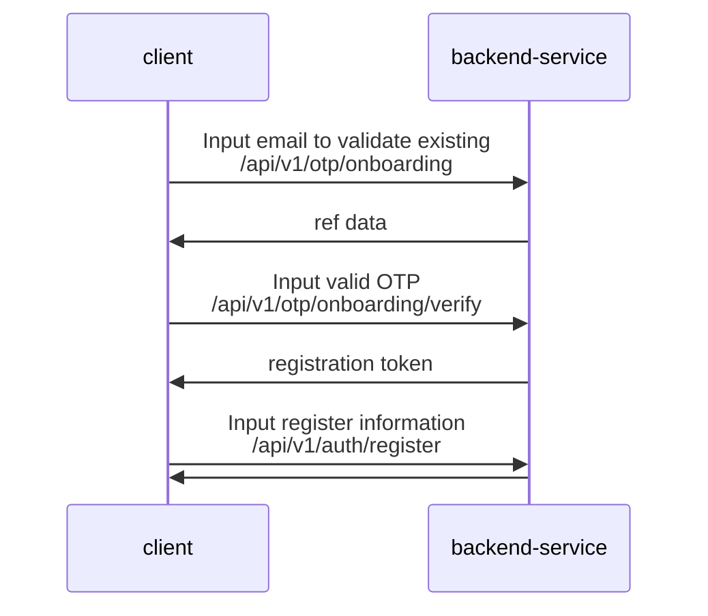

# Primary parent registration

## Sequence diagram

```mermaid
sequenceDiagram
    participant c as client
    participant bs as backend-service

    c ->> bs: Input email to validate existing<br/>/api/v1/otp/onboarding
    bs ->> c: ref data
    c ->> bs: Input valid OTP<br/>/api/v1/otp/onboarding/verify
    bs ->> c: registration token
    c ->> bs: Input register information<br/>/api/v1/auth/register
    bs ->> c:
```
