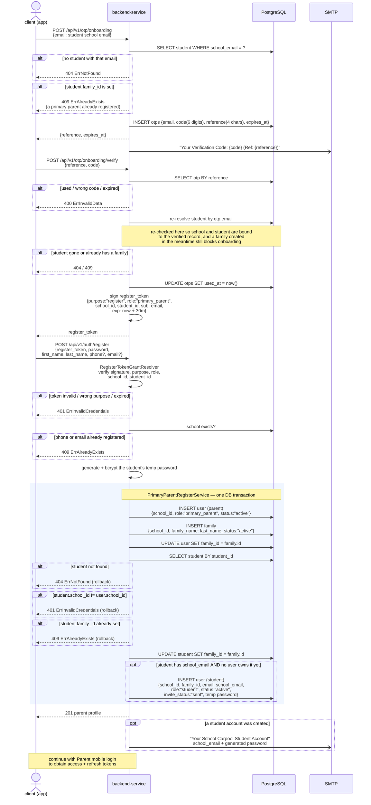

# Primary parent registration flow

## Overview

The first parent of a family onboards by proving control of **one of their
children's school email addresses**. The email must belong to an existing
student record that is **not yet attached to any family** — that is what makes
the account eligible to become a `primary_parent`.

The parent's school **and the student itself** are derived from the matched
student record, not from the email domain. OTP verification returns a
short-lived `register_token` carrying both, and registration then performs the
whole family setup **in a single database transaction**:

1. create the parent user (`primary_parent`)
2. create a new family and assign it to the parent
3. attach the verified student to that family
4. provision the **student's own login account** with a generated password

Because it is one transaction, a failure at any step rolls the whole thing back
— there is no half-created family. Once it commits, the student's credentials
are emailed to their school address.

| | |
| --- | --- |
| Identity used | a student's school email (`students.school_email`) |
| OTP delivery | email to that school address |
| `register_token` TTL | **30 minutes** |
| Role granted | `primary_parent` |
| Side effects | a new `family` row, the student attached to it, and a `student` user account created |

> The student used for onboarding does **not** need a separate invitation — it
> is attached automatically. Use [Invite student](/invite-student) only for
> *additional* children.

## Sequence diagram

## Registration request

`register_token` and `invitation_code` are mutually exclusive — exactly one must
be present. This flow uses `register_token`.

| Field | Rule |
| --- | --- |
| `register_token` | required unless `invitation_code` is given; must be omitted when `invitation_code` is present |
| `password` | required |
| `first_name` / `last_name` | required |
| `phone` | optional on its own, but **at least one of `phone` / `email` must be present** |
| `email` | optional, same rule as above |

`phone` is no longer a hard requirement — a parent who only has an email can
register. Whatever is supplied is checked for uniqueness before the user is
created, and `phone` is normalized (spaces, `-`, `()`, leading `+`/`0066`, and
`66…` → `0…`) before both the uniqueness check and storage.

## Register token claims

| Claim | Value |
| --- | --- |
| `purpose` | `"register"` — rejected if anything else |
| `role` | `"primary_parent"` |
| `school_id` | taken from the verified student record |
| `student_id` | the verified student — this is what gets attached to the new family |
| `family_id` | **absent** in this flow — the family does not exist yet |
| `sub` | the verified school email |
| `exp` | 30 minutes after verification |

Registration is dispatched on `role`: `primary_parent` goes to
`PrimaryParentRegisterService` (creates the family), `student` to
`StudentRegisterService`, everything else to `FamilyMemberRegisterService` —
and those two **require** a `family_id` in the grant, failing with
`401 ErrInvalidCredentials` without one.

## The auto-created student account

Provisioning the student's login happens inside the same transaction, using the
data already on the student record:

| Field | Source |
| --- | --- |
| `email` | `student.school_email` |
| `first_name` / `last_name` | the student record |
| `school_id` | the student record |
| `family_id` | the family just created |
| `role` | `student` |
| `status` | `active` |
| `invite_status` | `sent` |
| password | randomly generated, bcrypt-hashed, emailed in plaintext |

Two cases **skip** provisioning without failing the registration — the parent
still gets a `201`, but no student account and no email:

- the student record has an empty `school_email`
- a user already exists with that email

The student then logs in with the `password` grant and is expected to change the
password immediately. See [Parent mobile login](/parent-mobile-login).

## Error cases

| Situation | Result |
| --- | --- |
| Email matches no student record | `404 ErrNotFound` |
| Student already belongs to a family | `409 ErrAlreadyExists` |
| Wrong OTP code, expired OTP, or OTP already used | `400 ErrInvalidData` |
| `register_token` invalid, wrong `purpose`, or expired | `401 ErrInvalidCredentials` |
| `student_id` claim missing or unparsable | `401 ErrInvalidCredentials` |
| Neither `phone` nor `email` supplied | `400 ErrInvalidData` |
| `phone` or `email` already registered | `409 ErrAlreadyExists` |
| Student's `school_id` differs from the grant's | `401 ErrInvalidCredentials` (rollback) |
| Student picked up a family between OTP verify and register | `409 ErrAlreadyExists` (rollback) |

Every failure after the transaction opens rolls back the parent user, the
family, and the student link together — a retry starts from a clean state,
provided the `register_token` has not expired.

## Related flows

- [Invite student](/invite-student) — attach **additional** students to the
  family by school email
- [Add family members](/add-family-members) — invite an `additional_parent` or
  `supplementary` member by phone
