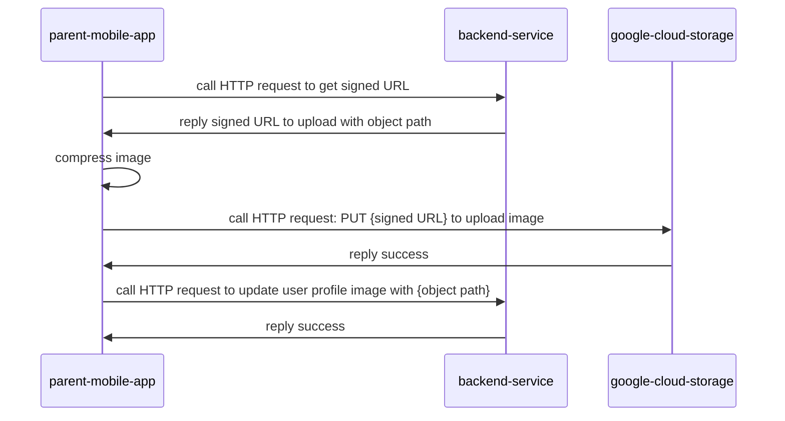

## Sequence diagram



## Example cURL to update image profile

```bash
curl --request PUT \
  --url 'https://storage.googleapis.com/xxx/profile-images/xxx.png?X-Goog-Algorithm=XXX&X-Goog-Credential=XXX&X-Goog-Date=20260524T062845Z&X-Goog-Expires=899&X-Goog-Signature=XXX&X-Goog-SignedHeaders=XXX' \
  --header 'content-type: image/png' \
  --data-binary '@/Users/mac/downloads/profile.png'
```

## Example response of signed url

```base
{
  "data": {
    "upload_url": "https://storage.googleapis.com/xxx/profile-images/xxx.png?X-Goog-Algorithm=XXX&X-Goog-Credential=XXX&X-Goog-Date=20260524T062845Z&X-Goog-Expires=899&X-Goog-Signature=XXX&X-Goog-SignedHeaders=XXX",
    "object_path": "profile-images/xxx.png",
    "expires_at": "2026-05-24T09:00:09.769792589Z"
  }
}
```

| key         | description                   | example                                 |
| ----------- | ----------------------------- | --------------------------------------- |
| upload_url  | for upload image              | https://storage.googleapis.com/xxx/.... |
| object_path | for update user profile image | profile-images/xxx.png                  |
| expires_at  | upload_url TTL (15 minutes)   | 2026-05-24T09:00:09.769792589Z          |
