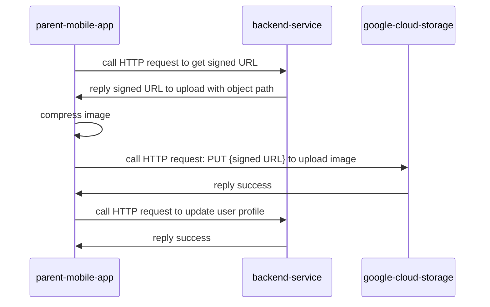

## Sequence diagram

```mermaid
sequenceDiagram
participant pma as parent-mobile-app
participant bs as backend-service
participant gcs as google-cloud-storage

pma ->> bs: call HTTP request to get signed URL
bs ->> pma: reply signed URL to upload with object path
pma ->> pma: compress image
pma ->> gcs: call HTTP request: PUT {signed URL} to upload image
gcs ->> pma: reply success
pma ->> bs: call HTTP request to update user profile
bs ->> pma: reply success
```
